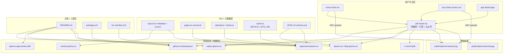
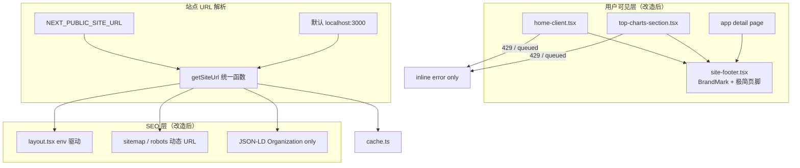

# 引流剔除架构设计

> **关联**：[需求文档（PRD）](./引流剔除-需求.md) · [测试用例](./引流剔除-测试用例.md)

---

## 1. 现状架构（引流分布）



**结论**：引流枢纽是 `site-footer.tsx`；限流路径通过 `RewardSupportDialog` 二次导流；SEO 层硬编码官方域；文档层重复推广。

---

## 2. 目标架构



**设计原则**：

1. **单点收口**：站点 URL 由 `getSiteUrl()` 统一解析，禁止散落硬编码。
2. **组件瘦身**：`site-footer.tsx` 仅导出 `BrandMark`、`SiteFooter`（极简版）。
3. **限流与引流解耦**：429/queued 只走 `setError(message)`，不触发任何 Dialog。
4. **统计 opt-in**：Umami 仅在用户显式配置 `NEXT_PUBLIC_UMAMI_WEBSITE_ID` + 自定义 domain 时加载。

---

## 3. 模块改动设计

### 3.1 `site-footer.tsx` 重构

**删除**：

- `profileLinks` 数组及渲染
- `RewardSupportDialog` 组件
- `SiteAffordances` 组件
- `Gift`、`Github`、`MessageCircle`、`QrCode`、`Sparkles`、`ArrowUpRight` 等相关 import（若不再使用）
- 页脚「Qiaomu Network」nav、宣传文案、© 向阳乔木

**保留**：

- `BrandName` / `BrandMark`（产品标识，无外链）
- `SiteFooter` 简化为：品牌 + 一行中性描述 + 可选 `© {year}` 无个人名

**目标结构**：

```tsx
// 导出
export function BrandMark({ compact?: boolean })
export function SiteFooter()

// 不再导出
// RewardSupportDialog, SiteAffordances
```

### 3.2 `home-client.tsx` / `top-charts-section.tsx`

| 改动 | 说明 |
|------|------|
| 删除 import | `RewardSupportDialog`, `SiteAffordances` |
| 删除 state | `rewardOpen`, `setRewardOpen` |
| 删除 JSX | `<SiteAffordances />`, `<RewardSupportDialog />` |
| 修改 429 分支 | 移除 `setRewardOpen(true)`，保留 `setError(message)` |

### 3.3 站点 URL 统一（新建或扩展）

**方案 A（推荐）**：在 `src/lib/site-url.ts` 新增：

```ts
const DEFAULT = 'http://localhost:3000';

export function getSiteUrl(): string {
  return (process.env.NEXT_PUBLIC_SITE_URL || DEFAULT).replace(/\/$/, '');
}

export function getMetadataBase(): URL {
  return new URL(getSiteUrl());
}
```

**引用方替换**：

| 文件 | 原写法 | 新写法 |
|------|--------|--------|
| `layout.tsx` | `new URL("https://appreview.qiaomu.ai")` | `getMetadataBase()` |
| `page.tsx` | 硬编码 canonical | `` `${getSiteUrl()}/` `` |
| `sitemap.ts` | 常量 | `getSiteUrl()` |
| `robots.ts` | 硬编码 | `` `${getSiteUrl()}/sitemap.xml` `` |
| `cache.ts` | `DEFAULT_SITE_URL` | 复用 `getSiteUrl()` 或同逻辑 |
| `apps/.../page.tsx` | JSON-LD urls | `getSiteUrl()` + 移除 author 个人 url |

> `sitemap.ts` / `robots.ts` 为 Server 模块，可直接读 env；客户端组件不应 import server-only 模块，故 `getSiteUrl` 保持纯 env 读取、无 `server-only`。

### 3.4 JSON-LD 改造（app detail page）

**现状**：

```json
{
  "author": { "@type": "Person", "name": "向阳乔木", "url": "https://qiaomu.ai" },
  "publisher": { "url": "https://appreview.qiaomu.ai", ... }
}
```

**目标**：

```json
{
  "author": { "@type": "Organization", "name": "App Review Insights" },
  "publisher": {
    "@type": "Organization",
    "name": "App Review Insights",
    "url": "<getSiteUrl()>",
    "logo": { "url": "<getSiteUrl()>/logo.svg" }
  }
}
```

产品名可与 fork 方 `package.yml` 的 `name` 对齐，本期可用中性名。

### 3.5 Umami 统计

**现状**（`layout.tsx`）：

```tsx
const umamiDomain = process.env.NEXT_PUBLIC_UMAMI_DOMAIN || "appreview.qiaomu.ai";
// ...
src="https://umami.qiaomu.ai/script.js"
```

**目标**：

```tsx
const umamiWebsiteId = process.env.NEXT_PUBLIC_UMAMI_WEBSITE_ID;
const umamiScriptSrc = process.env.NEXT_PUBLIC_UMAMI_SCRIPT_SRC; // 可选，无默认

{umamiWebsiteId && umamiScriptSrc ? (
  <Script src={umamiScriptSrc} data-website-id={umamiWebsiteId} ... />
) : null}
```

`.env.example` 删除 qiaomu 默认域，改为注释说明「自填统计服务」。

### 3.6 静态资源清理

删除目录 `public/qiaomu/`（含 `reward.png`、`wechat.jpg`）。

构建前 grep 确认无残留引用：`/qiaomu/reward`、`/qiaomu/wechat`。

### 3.7 文档与上架元数据

| 文件 | 改动要点 |
|------|----------|
| `README.md` | 删 badge 区（Demo/Skill/stars）、样例线上链接、作者节、skills add；clone 改为本地路径或 fork 仓库 |
| `package.yml` | `author` → fork 方；删/改 `homepage`；description 删「上游 GitHub」 |
| `lzc-manifest.yml` | usage 删上游链接与 `?whois=qiaomu` 对外说明（或改通用管理员说明） |
| `.env.example` | 默认 URL 改 `http://localhost:3000` |
| `scripts/deploy.sh` | 删 `appreview.qiaomu.ai` 硬编码提示 |

---

## 4. 数据流：限流（改造前后）

### 改造前

```
POST /api/research
  → 429 或 generation.status === 'queued'
    → home-client / top-charts: setRewardOpen(true)
      → RewardSupportDialog（打赏二维码）
```

### 改造后

```
POST /api/research
  → 429 或 generation.status === 'queued'
    → setError(message) 或展示 generation.message 内联条
      → 用户看到「今日次数已用完…」，无弹窗
```

API 层（`src/app/api/research/route.ts`）**无需改动**，消息已中性。

---

## 5. 文件改动矩阵

| 文件 | Phase | 操作 |
|------|-------|------|
| `src/components/app-review/site-footer.tsx` | 1 | 重构删减 |
| `src/components/app-review/home-client.tsx` | 1 | 删引流引用 |
| `src/components/app-review/top-charts-section.tsx` | 1 | 删 RewardSupportDialog |
| `public/qiaomu/reward.png` | 1 | 删除 |
| `public/qiaomu/wechat.jpg` | 1 | 删除 |
| `src/lib/site-url.ts` | 2 | **新增** |
| `src/app/layout.tsx` | 2 | env 化 metadata + umami |
| `src/app/page.tsx` | 2 | env 化 canonical |
| `src/app/sitemap.ts` | 2 | 用 getSiteUrl |
| `src/app/robots.ts` | 2 | 用 getSiteUrl |
| `src/lib/appstore/cache.ts` | 2 | 用 getSiteUrl |
| `src/app/api/health/route.ts` | 2 | service 改通用名 |
| `src/app/apps/.../page.tsx` | 2 | JSON-LD 改造 |
| `README.md` | 3 | 删推广内容 |
| `package.yml` | 3 | 改 author/homepage/description |
| `lzc-manifest.yml` | 3 | 删上游说明 |
| `.env.example` | 3 | 改默认值 |
| `scripts/deploy.sh` | 3 | 改提示文案 |

**不在本期改动**：

- `src/hooks/useAuth.ts`（`?whois=qiaomu`）
- `LICENSE`
- `QIAOMU_LLM_*` 环境变量名
- Apple / DeepSeek / Moonshot API URL

---

## 6. 部署与环境变量

| 变量 | 改造前默认 | 改造后默认 | 说明 |
|------|------------|------------|------|
| `NEXT_PUBLIC_SITE_URL` | `appreview.qiaomu.ai` | `http://localhost:3000` | 懒猫部署用 `https://{{ .S.AppDomain }}`（manifest 已有） |
| `NEXT_PUBLIC_UMAMI_DOMAIN` | `appreview.qiaomu.ai` | 空 | 不配则不加载 |
| `NEXT_PUBLIC_UMAMI_WEBSITE_ID` | 空 | 空 | opt-in |
| `NEXT_PUBLIC_UMAMI_SCRIPT_SRC` | 无 | 新增可选 | 自托管 Umami 脚本地址 |

懒猫 `lzc-manifest.yml` 已设置 `NEXT_PUBLIC_SITE_URL=https://{{ .S.AppDomain }}`，LPK 部署无需额外改 manifest URL 逻辑。

---

## 7. 回滚策略

| 层级 | 回滚方式 |
|------|----------|
| UI | git revert Phase 1 commit |
| SEO | 恢复硬编码 URL（不推荐） |
| 静态资源 | 从 git history 恢复 `public/qiaomu/` |
| 文档 | revert README / package.yml |

建议 Phase 1–3 分三个 commit，便于 partial revert。

---

## 8. 与 rebranding 的关系

本期「引流剔除」与「品牌重塑」解耦：

- 本期：删外链、删弹窗、env 化 URL、中性 JSON-LD
- 下期（可选）：改 `package` id、应用名、icon、`QIAOMU_LLM_*` → `APP_REVIEW_LLM_*`、`?whois=qiaomu` → 正式鉴权

两期可独立交付，本期不阻塞 LPK 上架。
