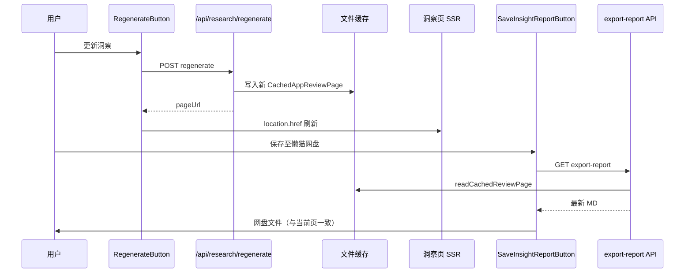

# 洞察页网盘导出 — 架构设计（Arch）

> **关联**：[01-需求](./01-需求.md) · [03-测试用例](./03-测试用例.md) · [网盘对接架构](../网盘对接-架构设计.md)（inject / save-to-disk 已落地）  
> 版本：v0.1 · 2026-06-17 · 范围：缓存洞察页 Markdown → 懒猫网盘

---

## 1. 设计目标

| 目标 | 说明 |
|------|------|
| 最小增量 | **不改** inject、manifest、管理端 export 链路；只补洞察页 API + MD 生成器 + 按钮 |
| 数据同源 | 导出读与 SSR 页面相同的 `CachedAppReviewPage`，更新洞察后再导出即最新版 |
| 内容对齐 | MD 章节映射页面模块，而非复用 `ReportGenerator`（`AggregatedAnalysis`） |
| 可测试 | 生成器纯函数 + Vitest；网盘/inject 仍走 L3 手工 |
| 可回退 | 无 inject / 无 File System Access API 时走 `fallback-download` |

---

## 2. 现状架构

```
┌─────────────────────────────────────────────────────────────────────┐
│ 洞察页 SSR  /apps/{country}/{appId}                                  │
│   page.tsx (Server)                                                  │
│     readCachedReviewPage / generateCachedReviewPage                  │
│     → 渲染 stats / insights / diagnostics / reviews                  │
│     [App Store] [更新洞察 RegenerateButton]   ← 无导出               │
└──────────────────────────┬──────────────────────────────────────────┘
                           │ 文件缓存
┌──────────────────────────▼──────────────────────────────────────────┐
│ src/lib/appstore/cache.ts                                            │
│   CachedAppReviewPage → .lzcapp/var 下 JSON 缓存                     │
└─────────────────────────────────────────────────────────────────────┘

┌─────────────────────────────────────────────────────────────────────┐
│ 管理端（已有，本专题不改动）                                           │
│   analysis-dashboard → /api/apps/{id}/export-report                  │
│     → ReportGenerator.generateMarkdownReport(AggregatedAnalysis)     │
│     → saveMarkdownReportToDisk(appId, appName)                       │
└─────────────────────────────────────────────────────────────────────┘
```

**缺口**：洞察页无导出入口；无面向 `CachedAppReviewPage` 的 API 与 MD 生成器。

---

## 3. 目标架构

```
┌──────────────────────────────────────────────────────────────────────┐
│ 浏览器（懒猫 WebShell + inject 已注入）                                 │
│  page.tsx (Server)                                                    │
│    └─ SaveInsightReportButton (Client)  country + appId + appName     │
│         └─ saveCachedInsightReportToDisk()                            │
│              1. fetch /api/appstore/{country}/{appId}/export-report   │
│              2. showSaveFilePicker → inject → 懒猫网盘               │
└──────────────────────────┬───────────────────────────────────────────┘
                           │ GET
┌──────────────────────────▼───────────────────────────────────────────┐
│ Next.js API（新增）                                                       │
│  export-report/route.ts                                                  │
│    readCachedReviewPage(country, appId)                                  │
│      │ miss → generateCachedReviewPage({ analyze: true })  （与 SSR 一致）│
│    CachedInsightReportGenerator.generate(page) → markdown string         │
└──────────────────────────┬───────────────────────────────────────────────┘
                           │
┌──────────────────────────▼───────────────────────────────────────────────┐
│ 数据与更新链路（已有）                                                       │
│  RegenerateButton → POST /api/research/regenerate → 刷新 cache            │
│  用户再次打开 /apps/... 或 reload → page + export 均读最新 cache           │
└────────────────────────────────────────────────────────────────────────────┘
```

---

## 4. 分层设计

### 4.1 平台层（无变更）

| 组件 | 状态 |
|------|------|
| `lzc-manifest.yml` injects | **不改** |
| `public/lazycat-injects/lzc-file-chooser-inject.js` | **不改** |
| `save-to-disk.ts` | **复用**，通过 `deps.fetchReport` 注入新 URL |

### 4.2 后端 — 导出 API（新增）

**路径**：`src/app/api/appstore/[country]/[appId]/export-report/route.ts`

```typescript
// 伪代码
export async function GET(req, { params }) {
  const country = normalizeCountry(params.country);
  const { appId } = params;
  const format = searchParams.get('format') ?? 'markdown';

  let page = await readCachedReviewPage(country, appId);
  if (!page) {
    const generated = await generateCachedReviewPage({
      appId, country, maxReviews: 160, analyze: true,
    });
    page = generated.page;
  }

  if (!page.stats.totalReviews) {
    return NextResponse.json({ error: '暂无评论样本' }, { status: 404 });
  }

  if (format !== 'markdown') {
    return NextResponse.json({ error: '仅支持 markdown' }, { status: 400 });
  }

  const markdown = CachedInsightReportGenerator.generate(page);
  const filename = buildReportFilename(page.app.name, new Date());

  return new NextResponse(markdown, {
    headers: {
      'Content-Type': 'text/markdown; charset=utf-8',
      'Content-Disposition': `attachment; filename="${encodeURIComponent(filename)}"`,
      'Cache-Control': 'no-cache',
    },
  });
}
```

**设计要点**：

| 项 | 决策 |
|----|------|
| 缓存 miss | 与 SSR `getPage()` 相同：按需 generate，避免导出空页 |
| 404 | 无样本；不区分「App 不存在」与「零评论」（MVP 统一文案） |
| 400 | 非 markdown format |
| 鉴权 | 与洞察页一致，公开可读（无额外 token） |

### 4.3 后端 — MD 生成器（新增）

**路径**：`src/lib/report/cached-insight-report.ts`

**输入**：`CachedAppReviewPage`（`cache.ts` 导出类型）

**输出**：Markdown 字符串

**章节与页面对照**：

| MD 章节 | 页面模块 | 数据来源 |
|---------|----------|----------|
| `# {name} 评价分析` | 标题区 | `page.app` |
| 元信息 | 头部 + 侧栏 | `country`、`artistName`、`updatedAt`、`model`、`canonicalUrl` |
| 样本概览 | 四格统计 + 星级条 | `page.stats` |
| 数据来源 | ReviewSourceBreakdownPanel | `page.sourceBreakdown` |
| 摘要 | 摘要卡片 | `page.insights?.executiveSummary` 或占位 |
| 版本与口碑诊断 | VersionDiagnosticsPanel | `page.diagnostics.insights` + `versionTrend` 摘要 |
| 洞察矩阵 | InsightGrid | `painPoints` / `opportunities` / … / `actionPlan` |
| 版本样本 | 左侧版本列表 | `page.stats.versionDistribution` |
| 评论证据 | 评论列表 | `page.reviews`（页面展示条数，通常 ≤80） |
| 附录 | 页脚 FAQ 语气 | 固定模板 + `generatedAt` |

**洞察条目格式**（统一 helper）：

```markdown
### {title}
- **优先级**: 高/中/低
- **摘要**: {summary}
- **证据**: {evidence}
```

**无 AI insights 时**：

- 仍输出 stats、diagnostics（若有）、reviews
- 摘要章节写：`AI 洞察暂未生成；以下为评论统计与证据样本。`
- `canSaveInsightReport` 仍允许导出（PRD P1：有 stats + reviews 即可）

**实现约束**：

- 纯函数 `CachedInsightReportGenerator.generate(page)`，便于 L1 单测
- 日期格式与页面 `formatDate` 一致（zh-CN）
- 百分比与页面 `formatPercent` 一致（四舍五入整数 %）
- 不嵌入 HTML / 不输出 API Key

### 4.4 前端 — Client 按钮（新增）

**路径**：`src/components/app-review/save-insight-report-button.tsx`

```typescript
'use client';

interface Props {
  country: string;
  appId: string;
  appName: string;
  totalReviews: number;
  hasInsights: boolean; // 可选：控制 tooltip，不禁用导出
}

// 内部调用 saveCachedInsightReportToDisk(country, appId, appName)
```

**路径**：`src/lib/lazycat/save-insight-report.ts`（薄封装）

```typescript
export async function saveCachedInsightReportToDisk(
  country: string,
  appId: string,
  appName: string,
  deps?: SaveMarkdownDeps,
) {
  return saveMarkdownReportToDisk(appId, appName, {
    ...deps,
    fetchReport: deps?.fetchReport ?? (() =>
      fetch(`/api/appstore/${country}/${appId}/export-report?format=markdown`)),
  });
}
```

> 注：`saveMarkdownReportToDisk` 第一个参数仍叫 `appId`，此处仅用于满足签名；实际请求 URL 由 `fetchReport` 覆盖。**不修改**管理端默认 fetch 行为。

**启用条件**：`src/lib/lazycat/can-save-insight-report.ts`

```typescript
export function canSaveInsightReport(page: Pick<CachedAppReviewPage, 'stats'>): boolean {
  return page.stats.totalReviews > 0;
}
```

**挂载点**：`page.tsx` 头部操作区，与 `RegenerateButton` 并列：

```tsx
<RegenerateButton appId={page.app.id} country={page.app.country} />
<SaveInsightReportButton
  country={page.app.country}
  appId={page.app.id}
  appName={page.app.name}
  totalReviews={page.stats.totalReviews}
  hasInsights={Boolean(insights)}
/>
```

**UI 状态**：

| 状态 | 表现 |
|------|------|
| `!canSaveInsightReport` | disabled + title「暂无评论样本」 |
| saving | 「保存中…」+ spinner |
| success + file-picker | 静默（或可选 toast「已保存」） |
| success + fallback | alert「当前环境不支持网盘选择器，已改为本地下载」 |
| USER_CANCELLED | 静默 |
| 其他错误 | alert 错误文案 |

### 4.5 更新洞察后的数据一致性



**关键**：导出 API **必须** `readCachedReviewPage`，不能读内存 stale 状态；刷新页面后 SSR 与 export 同源。

---

## 5. 接口契约

### 5.1 新增 API

```
GET /api/appstore/{country}/{appId}/export-report?format=markdown
```

| 状态 | 响应 |
|------|------|
| 200 | `Content-Type: text/markdown`；body 为报告全文 |
| 400 | `{ "error": "仅支持 markdown" }` |
| 404 | `{ "error": "暂无评论样本" }` |
| 500 | `{ "error": "<message>" }` |

### 5.2 前端封装

```
saveCachedInsightReportToDisk(country, appId, appName): Promise<SaveResult>
canSaveInsightReport(page): boolean
CachedInsightReportGenerator.generate(page): string
```

`SaveResult` / 错误码与管理端 [网盘对接架构](../网盘对接-架构设计.md) §6.2 一致。

---

## 6. 文件变更清单

| 文件 | 操作 | 说明 |
|------|------|------|
| `src/lib/report/cached-insight-report.ts` | **新增** | MD 生成器 |
| `src/lib/lazycat/can-save-insight-report.ts` | **新增** | 按钮启用判断 |
| `src/lib/lazycat/save-insight-report.ts` | **新增** | 洞察页 save 薄封装 |
| `src/app/api/appstore/[country]/[appId]/export-report/route.ts` | **新增** | 导出 API |
| `src/components/app-review/save-insight-report-button.tsx` | **新增** | Client 按钮 |
| `src/app/apps/[country]/[appId]/[[...slug]]/page.tsx` | **修改** | 挂载按钮 |
| `src/lib/report/__tests__/cached-insight-report.test.ts` | **新增** | L1 |
| `src/lib/lazycat/__tests__/save-insight-report.test.ts` | **新增** | L2 |
| `src/app/api/appstore/.../__tests__/route.test.ts` | **新增** | L2 |

**不改动**：

- `save-to-disk.ts` 默认行为（管理端）
- `ReportGenerator` / `/api/apps/[id]/export-report`
- inject / manifest / `analysis-dashboard.tsx`

---

## 7. 兼容与回退

| 场景 | 行为 |
|------|------|
| 微服 + inject | 懒猫 / 本地二选一 |
| 本地 `npm run dev` | 无 inject → fallback 本地下载 |
| 更新洞察后立即导出 | 读最新 cache ✅ |
| 仅有 stats、无 AI | 仍可导出（摘要占位） |
| 管理端导出 | 不受影响 |

---

## 8. 安全与隐私

- 报告内容为 App Store 公开评论 + 聚合洞察，不含 LLM Key。
- 不写网盘路径到服务端日志。
- MD 不含微服登录用户信息。

---

## 9. 部署验证

```bash
cd qiaomu-app-review-insights
npm test                    # L1 + L2
lzc-cli project build
lzc-cli lpk install ./cloud.lazycat.app.qiaomu-appreview-v*.lpk
# 打开 /apps/cn/{appId} → 更新洞察 → 保存至懒猫网盘
# 执行 03-测试用例.md E2E-INS-004～006
```

---

## 10. 测试策略（金字塔）

| 层级 | 内容 | 文档 |
|------|------|------|
| L1 单元 | `CachedInsightReportGenerator`、`canSaveInsightReport` | [03-测试用例](./03-测试用例.md) §3 |
| L2 集成 | export API mock cache、`saveCachedInsightReportToDisk` | 同上 §4 |
| L3 E2E | 洞察页按钮 + 真网盘 + 更新后再导出 | 同上 §5 |

实现顺序：**生成器 UT → API IT → 按钮 → L3 手工**。

---

*文档版本：v0.1 · 日期：2026-06-17*
