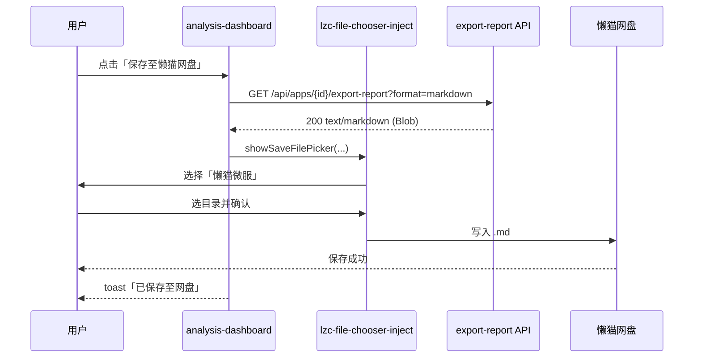

# 网盘对接 — 架构设计（Arch）

> **Agent Skill 入口**：[`resources/skills/netdisk-export/SKILL.md`](../resources/skills/netdisk-export/SKILL.md)  
> 关联文档：[网盘对接需求.md](./网盘对接需求.md) · [网盘对接-测试用例.md](./网盘对接-测试用例.md)  
> 版本：v0.1 · 2026-06-16 · 范围：Markdown 报告保存至懒猫网盘（MVP）

---

## 1. 设计目标

| 目标 | 说明 |
|------|------|
| 最小改动 | 后端零改动，复用 `export-report` |
| 平台合规 | 走官方 inject + `showSaveFilePicker`，满足商店「文件选择器」要求 |
| 可验证 | 每条链路可在微服 + 网盘 UI 内手动复现 |
| 可回退 | inject 失败时仍可保留原有「导出 MD」本地下载 |

---

## 2. 现状架构（改造前）

```
┌─────────────────────────────────────────────────────────────┐
│  浏览器（懒猫微服 WebShell）                                   │
│  analysis-dashboard.tsx                                      │
│    └─ exportReport() → fetch /api/apps/{id}/export-report    │
│         └─ <a download> Blob → 用户本地下载                  │
└──────────────────────────┬──────────────────────────────────┘
                           │ HTTP
┌──────────────────────────▼──────────────────────────────────┐
│  Next.js 容器 (appreview:3000)                               │
│  GET /api/apps/[id]/export-report                            │
│    └─ storage.getApps() + AnalysisService.generateAggregated │
│    └─ ReportGenerator.generateMarkdownReport()                 │
│  数据：/app/src/data ← bind → /lzcapp/var/data               │
└─────────────────────────────────────────────────────────────┘
```

**缺口**：保存路径止于浏览器下载，未接入懒猫网盘 API / 文件选择器。

---

## 3. 目标架构（改造后）

```
┌──────────────────────────────────────────────────────────────────┐
│ 浏览器                                                            │
│  ┌────────────────────────────────────────────────────────────┐  │
│  │ inject: lzc-file-chooser-inject.js (manifest 注入)          │  │
│  │   拦截 window.showSaveFilePicker()                          │  │
│  │   → 弹窗：「本地文件系统 / 懒猫微服」                        │  │
│  └────────────────────────────────────────────────────────────┘  │
│  analysis-dashboard.tsx                                          │
│    ├─ [保留] exportReport() → <a download>  （回退路径）          │
│    └─ [新增] saveReportToLazyCatDisk()                          │
│         1. fetch /api/apps/{id}/export-report?format=markdown    │
│         2. showSaveFilePicker({ suggestedName, types })          │
│         3. writable.write(blob)                                  │
└──────────────────────────┬───────────────────────────────────────┘
                           │
┌──────────────────────────▼───────────────────────────────────────┐
│ Next.js（无变更）                                                 │
│  export-report/route.ts → ReportGenerator → Markdown 字符串       │
└──────────────────────────┬───────────────────────────────────────┘
                           │ 用户选「懒猫微服」
┌──────────────────────────▼───────────────────────────────────────┐
│ 懒猫微服平台                                                      │
│  官方文件选择器 → 网盘目录 → 写入 {AppName}-分析报告-{date}.md    │
└──────────────────────────────────────────────────────────────────┘
```

---

## 4. 分层设计

### 4.1 LPK / 平台层

**文件**：`lzc-manifest.yml`

```yaml
application:
  subdomain: appreview          # fork 后建议修改
  routes:
    - /=http://appreview:3000
  injects:
    - id: netdisk-save-report
      on: browser
      when:
        - /*
      do:
        - src: file:///lzcapp/pkg/content/lazycat-injects/lzc-file-chooser-inject.js
          params:
            locale: auto
            hooks:
              fileSystemAccess: true   # 接管 showSaveFilePicker
              fileInput: false         # MVP 不需要上传
```

**说明**：

- `on: browser`：仅 Web 端注入，不影响 cron  sidecar。
- `when: /*`：全站生效；若需缩小范围可改为分析页路径（如 `/analysis/*`），MVP 用全站更简单。
- **不启用** `enable_media_access`：后端不写 `/lzcapp/media/RemoteFS`，降低复杂度。

### 4.2 构建 / 打包层

**文件**：`lzc-build.yml`、`public/lazycat-injects/`

| 项 | 方案 |
|----|------|
| inject 脚本来源 | 从懒猫开发者文档下载 `lzc-file-chooser-inject.js`，放入 `public/lazycat-injects/` |
| 打入 LPK | Next.js `public/` 随 Docker 镜像构建；若需 manifest 用 `file:///lzcapp/pkg/content/`，则在 `lzc-build.yml` 增加 `contentdir: ./public` **或** 确保 Dockerfile `COPY public` 后运行时可通过静态路径访问 |

**推荐路径（与 excalidraw 示例一致）**：

- 脚本物理路径：`public/lazycat-injects/lzc-file-chooser-inject.js`
- manifest 引用：`file:///lzcapp/pkg/content/lazycat-injects/lzc-file-chooser-inject.js`
- 需在 `lzc-build.yml` 确认 `contentdir` 或将 inject 复制到 LPK content 目录（实现阶段核对一次 `project build` 产物）

### 4.3 前端应用层

**新增模块**：`src/lib/lazycat/save-to-disk.ts`

职责单一：封装「拉报告 + 保存」逻辑，供按钮调用。

```typescript
// 伪代码 — 实现时以此为准
export async function saveMarkdownReportToDisk(appId: string, appName: string): Promise<SaveResult> {
  const res = await fetch(`/api/apps/${appId}/export-report?format=markdown`);
  if (!res.ok) throw new SaveReportError('EXPORT_FAILED', ...);

  const blob = await res.blob();
  const filename = `${sanitize(appName)}-分析报告-${date}.md`;

  if (!window.showSaveFilePicker) {
    // 无 File System Access API：回退本地下载
    downloadBlob(blob, filename);
    return { mode: 'fallback-download' };
  }

  const handle = await window.showSaveFilePicker({
    suggestedName: filename,
    types: [{ description: 'Markdown', accept: { 'text/markdown': ['.md'] } }],
  });
  const writable = await handle.createWritable();
  await writable.write(blob);
  await writable.close();
  return { mode: 'file-picker' };
}
```

**改造点**：`src/components/analysis/analysis-dashboard.tsx`

| 变更 | 说明 |
|------|------|
| 新增按钮 | `保存至懒猫网盘`，调用 `saveMarkdownReportToDisk` |
| 保留按钮 | `导出 MD` 不动，作为回退 |
| 禁用态 | 无 `analysis` 或 `totalReviews === 0` 时 disabled |
| 加载态 | 请求 export-report 期间按钮 loading |

**可选（Out of MVP）**：`report-preview.tsx` 同步加按钮 — 需求文档标记为可选。

### 4.4 后端 / 数据层

**无变更**。

| 组件 | 路径 | 职责 |
|------|------|------|
| 导出 API | `src/app/api/apps/[id]/export-report/route.ts` | 返回 Markdown/HTML/summary |
| 报告生成 | `src/lib/report/generator.ts` | 拼装报告正文 |
| 存储 | `src/lib/storage/local.ts` | JSON 持久化于 bind 目录 |

### 4.5 元数据层

**文件**：`package.yml`

- `description` / `locales.*.usage` 增加一句：「支持将分析报告导出至懒猫网盘」
- fork 时同步修改 `package`、`name`、`author`、`homepage`

---

## 5. 关键流程时序



**取消路径**：用户在任一步骤点取消 → `AbortError` → UI 提示「已取消」，不报错。

**API 失败路径**：404/500 → toast「导出失败，请先完成分析」，不打开选择器。

---

## 6. 接口契约

### 6.1 已有 API（不修改）

```
GET /api/apps/{id}/export-report?format=markdown|html|summary
```

| 状态 | 响应 |
|------|------|
| 200 | `Content-Type: text/markdown`，body 为报告全文 |
| 404 | `{ "error": "应用不存在" }` |
| 500 | `{ "error": "<message>" }` |

### 6.2 前端内部函数（新增）

```
saveMarkdownReportToDisk(appId: string, appName: string): Promise<SaveResult>
```

| SaveResult.mode | 含义 |
|-----------------|------|
| `file-picker` | 走 showSaveFilePicker（inject 可拦截到网盘） |
| `fallback-download` | 浏览器不支持 API，回退 `<a download>` |

| 错误码 | 场景 |
|--------|------|
| `EXPORT_FAILED` | export-report 非 2xx |
| `USER_CANCELLED` | 用户关闭选择器 |
| `WRITE_FAILED` | createWritable / write 失败 |

---

## 7. 文件变更清单

| 文件 | 操作 | 说明 |
|------|------|------|
| `public/lazycat-injects/lzc-file-chooser-inject.js` | 新增 | 官方 inject 脚本 |
| `lzc-manifest.yml` | 修改 | + `injects` |
| `lzc-build.yml` | 可能修改 | 确保 content/inject 进 LPK |
| `src/lib/lazycat/save-to-disk.ts` | 新增 | 保存封装 |
| `src/lib/lazycat/save-to-disk.types.ts` | 新增（可选） | 类型定义 |
| `src/components/analysis/analysis-dashboard.tsx` | 修改 | + 按钮与 handler |
| `package.yml` | 修改 | 描述 + fork 元数据 |
| `docs/*` | 已有 | 需求 / 架构 / 测试 |

**不改动**：`export-report/route.ts`、`ReportGenerator`、`lzc-manifest` cron 服务、Dockerfile 主体。

---

## 8. 兼容与回退

| 场景 | 行为 |
|------|------|
| inject 未加载 | `showSaveFilePicker` 为原生浏览器行为 → 仍可能存本地；用户可用「导出 MD」 |
| 非安全上下文 / 旧浏览器 | 检测无 `showSaveFilePicker` → 自动 `fallback-download` |
| 非懒猫环境（本地 npm dev） | inject 不存在；保存等同本地下载，开发不受影响 |
| 用户选「本地文件系统」 | inject 允许；仍算「已接文件选择器」，合规 |

---

## 9. 安全与隐私

- 报告内容来自已有分析数据，**不包含** LLM API Key。
- 不写网盘路径到服务端日志。
- 不新增后端网盘凭证；网盘权限由平台文件选择器托管。

---

## 10. 部署验证（Arch 级）

```bash
lzc-cli project build
lzc-cli app install ./cloud.lazycat.app.<pkg>-<ver>.lpk
# 浏览器打开应用 → 执行测试用例文档 TC-001～TC-005
```

构建后抽查 LPK 内是否包含：

- [ ] `lzc-manifest.yml` 含 `injects` 段
- [ ] inject 脚本路径在容器内可访问（`/lzcapp/pkg/content/lazycat-injects/...`）

---

## 11. 后续扩展（非 MVP）

| 扩展 | 架构影响 |
|------|----------|
| CSV 保存网盘 | 复用 `save-to-disk.ts`，换数据源为 reviews API |
| `file_handler` 打开 .md | + manifest `file_handler` + 新页面 `/reports/view` |
| 定时写网盘 | + `enable_media_access` + cron 后处理 job |

---

## 12. 测试策略（金字塔）

| 层级 | 内容 | 文档 |
|------|------|------|
| L1 单元 | `save-to-disk`、文件名、ReportGenerator | [网盘对接-测试用例.md](./网盘对接-测试用例.md) §3 |
| L2 集成 | export-report API + mock 文件选择器 | 同上 §4 |
| L3 E2E | 微服真网盘 + inject 合规 | 同上 §5 |

实现时先写 L1/L2（`npm test`），提审前跑 L3 手工验收。

---
